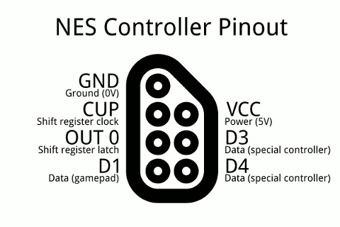

# MinoBoy

MinoBoy is a project created as part of the "Introduction to Embedded Programming" classes, in order to acquire a grade.

The name "MinoBoy" was chosen to represent the idea of a GameBoy using an ESP32-C3-DevKitM-1 circuit board, the NES Controller for controls, and an LCD 240x240 IPS display to graphically render the game (though it's more NES-like than a GameBoy, but let's just roll with that for now).

## Hardware Components

The following hardware components were used:

* Soldering Equipment
* [ESP32-C3-DevKitM-1](https://amzn.eu/d/9a1SwUs)
* [NES Extension Cord](https://www.micomputer.es/en/nes/450-super-nintendo-extension-cable.html)
* Male-To-Male Pin Connectors
* [Dollatek TFT-LCD-Display (240x240 IPS, 3.3V with SPI Interface)](https://www.amazon.de/gp/product/B07QJY5H9G/)

### Figuring out the NES extension cord pinout

Given that there was no pinout given by the manufacturer, it was required to open up the female end of the extension cord. For that, we need to look at the actual NES Controller pinout, so we can compare and figure out which wire is which.

Based on this, we can look at the pinout at the female end.

